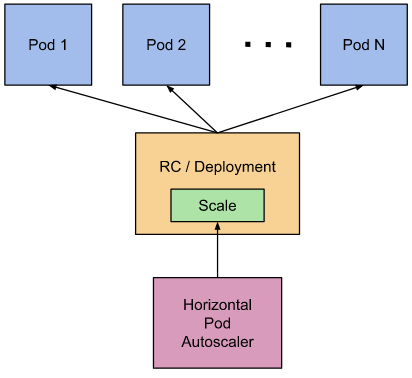
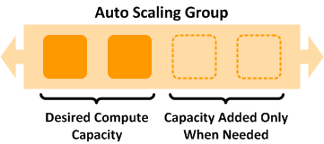

# Elastic Container Service for Kubernetes - Amazon EKS

[](https://travis-ci.org/punkerside/eksctl-demo)
[](https://github.com/punkerside/eksctl-demo/issues)
[](https://github.com/punkerside/eksctl-demo/tags/)
[](https://opensource.org/licenses/Apache-2.0)

<p align="center">
  
</p>

Kubernetes es un software de código abierto que le permite implementar y administrar aplicaciones en contenedores a escala. Kubernetes administra clústeres de instancias de informática de Amazon EC2 y ejecuta contenedores en ellas con procesos destinados a implementación, mantenimiento y escalado.

## Prerequisite

* [Instalar eksctl](https://eksctl.io/introduction/installation/)
* [Instalar awscli](https://docs.aws.amazon.com/cli/latest/userguide/cli-chap-install.html)

**NOTA:** Configurar las credenciales en el servicio [AWS CLI](https://docs.aws.amazon.com/cli/latest/reference/configure/).

Como depedencia se necesita una infraestructura de red base debidamente etiquetada para poder detectar automaticamente las redes privadas y publicas. Para esto podemos utilizar la siguiente plantilla de VPC:

* [Amazon Virtual Private Cloud](https://github.com/punkerside/terraform-aws-template-vpc)

## Recursos desplegados

### Amazon AWS

* Elastic Container Service for Kubernetes (EKS)
* EC2 Auto Scaling
* Elastic Load Balancing (ELB)
* Identity and Access Management (IAM)
* CloudWatch Container Insights

### Kubernetes

* Web UI (Dashboard)
* Metrics Server
* Cluster Autoscaler (CA)
* NGINX Ingress Controller
* GuestBook (app demo)

## Despliegue

* ### Cluster y nodos Kubernetes (EKS)

```bash
make create AWS_REGION=us-west-2 NODE_VER=1.13
```

* ### Instalando Web UI (Dashboard)

```bash
make addon-dashboard
```

<p align="center">
  
</p>

```bash
# iniciar dashboard
kubectl proxy
```

http://localhost:8001/api/v1/namespaces/kubernetes-dashboard/services/https:kubernetes-dashboard:/proxy/#/login

* ### Instalando Metrics Server

```bash
make addon-metrics
```

<p align="center">
  
</p>

* ### Instalando NGINX Ingress Controller

```bash
make addon-ingress
```
<p align="center">
  
</p>

* ### Instalando Cluster Autoscaler

```bash
make addon-autoscaler
```

<p align="center">
  
</p>

* ### Instalando GuestBook

```bash
make deploy-guestbook
```

http://guestbook.kubernetes.io


## Variables

| Name | Description | Type | Default | Required |
|------|-------------|:----:|:-----:|:-----:|
| OWNER | Nombre del propietario | string | punkerside | no |
| PROJECT | Nombre del proyecto | string | eks | no |
| ENV | Nombre del entorno | string | demo | no |
| AWS_REGION | Region de AWS | string | `us-east-1` | no |
| AWS_DOMAIN | Dominio de DNS | string | `punkerside.com` | no |
| NODE_VER | Version de Kubernetes | string | `1.14` | no |
| NODE_DES | Numero de nodos | string | `2` | no |
| NODE_MIN | Numero minimo de nodos para el escalamiento| string | `1` | no |
| NODE_MAX | Numero minimo de nodos para el escalamiento| string | `10` | no |

## Eliminar

Para eliminar la infraestructura creada y archivos temporales:

```bash
make delete
```