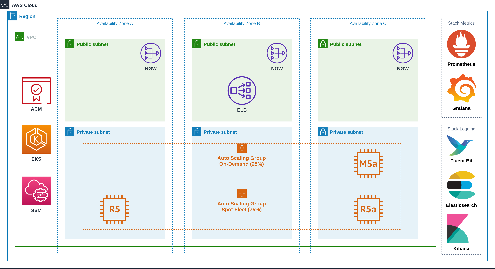
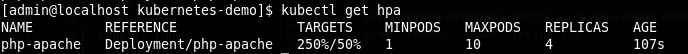
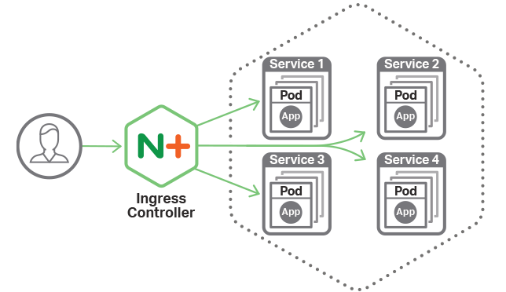
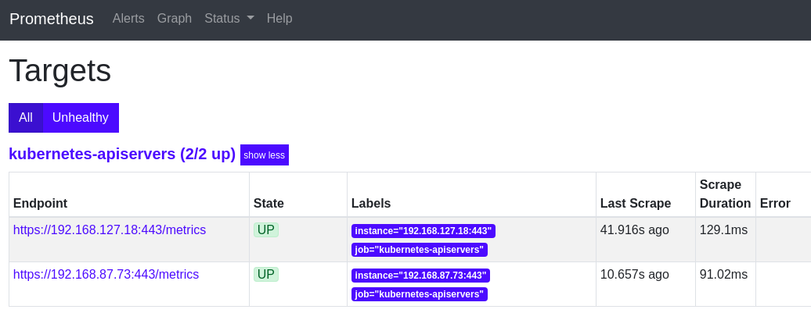
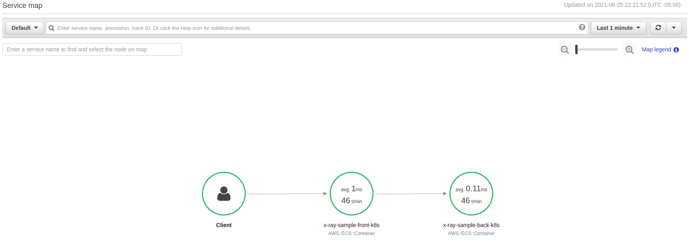
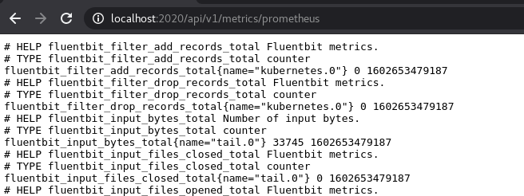

# Elastic Container Service for Kubernetes - Amazon EKS

[](https://travis-ci.org/punkerside/kubernetes-demo)
[](https://github.com/punkerside/kubernetes-demo/issues)
[](https://github.com/punkerside/kubernetes-demo/tags/)
[](https://opensource.org/licenses/Apache-2.0)

Kubernetes es un software de código abierto que le permite implementar y administrar aplicaciones en contenedores a escala.

Amazon EKS administra clústeres de instancias de informática de Amazon EC2 y ejecuta contenedores en ellas con procesos destinados a implementación, mantenimiento y escalado.

<p align="center">
  
</p>

## Prerequisite

* [Instalar eksctl](https://eksctl.io/introduction/installation/)
* [Instalar awscli](https://docs.aws.amazon.com/cli/latest/userguide/cli-chap-install.html)

## Recursos desplegados

### Amazon AWS

* Virtual Private Cloud (VPC)
* Identity and Access Management (IAM)
* Elastic Container Service for Kubernetes (EKS)
* EC2 Auto Scaling
* Elastic Load Balancing (ELB)

### Kubernetes

* Web UI (Dashboard)
* Metrics Server
* Cluster Autoscaler (CA)
* NGINX Ingress Controller
* Prometheus
* Grafana
* Fluent Bit
* Elasticsearch
* Kibana
* GuestBook

## Variables

| Name | Description | Type | Default | Required |
|------|-------------|:----:|:-----:|:-----:|
| PROJECT | Nombre del proyecto | string | `eks` | no |
| ENV | Nombre del entorno | string | `staging` | no |
| DOMAIN | Nombre del dominio | string | `punkerside.com` | no |
| AWS_REGION | Region de AWS | string | `us-east-1` | no |
| K8S_CLUS_VERS | Version de Kubernetes | string | `1.15` | no |
| K8S_NODE_TYPE | Tipo de instancia de los nodos | list | `["r5a.xlarge","m5a.xlarge","r5.xlarge","m5.xlarge"]` | no |
| K8S_NODE_SIZE | Numero de nodos | string | `2` | no |
| K8S_NODE_MINI | Numero minimo de nodos | string | `1` | no |
| K8S_NODE_MAXI | Numero maximo de nodos | string | `6` | no |
| DNS_OWNER | Crear registros DNS publicos (Route53) | string | `true` | no |
| ELB_SSL | Habilitar SSL en el NGINX Ingress Controller | string | `true` | no |

## Despliegue

1. Crear cluster y nodos

```bash
make create AWS_REGION=us-east-1
```

2. Instalar Metrics Server

```bash
make metrics
```

Para iniciar el escalado de pods:

```bash
kubectl run httpd --image=httpd --requests=cpu=100m --limits=cpu=200m --expose --port=80
kubectl autoscale deployment httpd --cpu-percent=20 --min=1 --max=20
kubectl run apache-bench -i --tty --rm --image=httpd -- ab -n 500000 -c 1000 http://httpd.default.svc.cluster.local/
```

Para revisar los registros del escalado:

```bash
kubectl get hpa
```

<p align="center">
  
</p>

3. Instalando Cluster Autoscaler

```bash
make autoscaler
```

Para revisar los registros del escalado:

```bash
kubectl logs -f deployment/cluster-autoscaler -n kube-system
```

4. Iniciando NGINX Ingress Controller:

```bash
make ingress ELB_SSL=false
```

<p align="center">
  
</p>

5. Instalando Web UI (Dashboard)

```bash
make dashboard
```

Iniciar dashboard

```bash
kubectl proxy
```

Capturar token

```bash
kubectl -n kube-system describe secret $(kubectl -n kube-system get secret | grep eks-admin | awk '{print $1}') | grep "token:" | awk '{print $2}'
```

Acceso al Dashboard http://localhost:8001/api/v1/namespaces/kubernetes-dashboard/services/https:kubernetes-dashboard:/proxy/#/login

<p align="center">
  
</p>

6. Instalando Helm

```bash
make helm
```

7. Instalando Prometheus

```bash
make prometheus
```

<p align="center">
  
</p>

Para validar el servicio: https://prometheus.punkerside.com

8. Instalando Grafana

```bash
make grafana DOMAIN=punkerside.com
```

Contraseña admin

```bash
kubectl get secret -n monitoring grafana -o jsonpath="{.data.admin-password}" | base64 --decode
```

Para validar el servicio: https://grafana.punkerside.com

<p align="center">
  
</p>

9. Instalando Elasticsearch

```bash
make elasticsearch
```

10. Instalando Fluent-Bit

```bash
make fluent-bit
```

11. Instalando Kibana

```bash
make kibana DOMAIN=punkerside.com
```

Para validar el servicio https://kibana.punkerside.com

<p align="center">
  
</p>

12. Desplegando GuestBook (aplicación demo)

```bash
make app DOMAIN=punkerside.com
```

Para validar el servicio https://guestbook.punkerside.com

<p align="center">
  
</p>

13. Configurar registros DNS publicos sobre AWS Route53

```bash
make dns DOMAIN=punkerside.com DNS_OWNER=false
```

## Eliminar

```bash
make delete
```

## Autor

[Ivan Echegaray Avendaño](https://github.com/punkerside/)