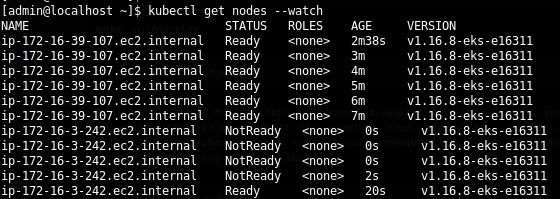
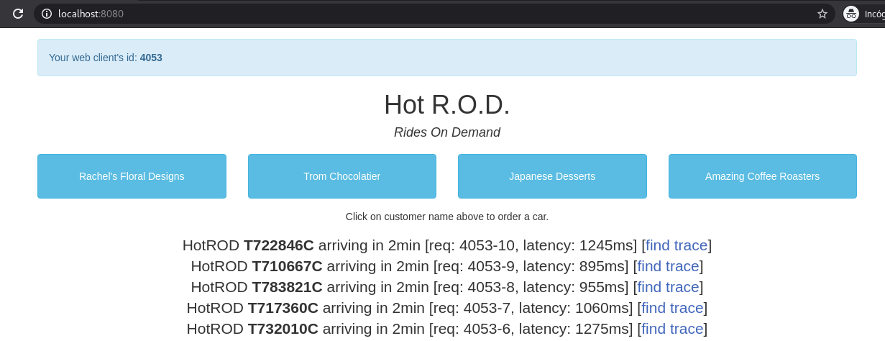
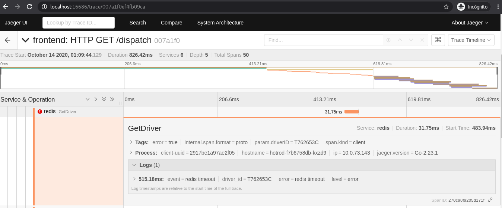
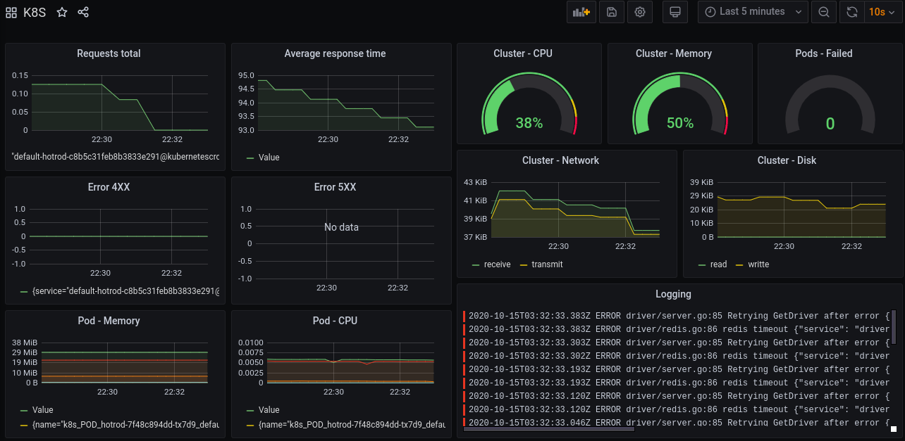
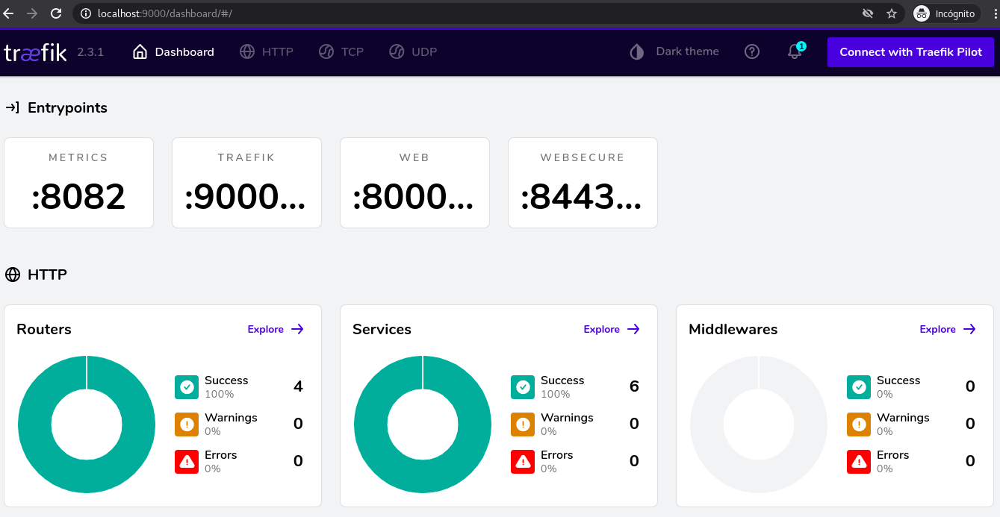

# Elastic Container Service for Kubernetes - Amazon EKS

[](https://travis-ci.org/punkerside/kubernetes-demo)
[](https://github.com/punkerside/kubernetes-demo/issues)
[](https://github.com/punkerside/kubernetes-demo/tags/)

<p align="center">
  
</p>

## **Prerrequisitos**

* [Instalar Terraform](https://www.terraform.io/downloads.html)
* [Instalar AWS CLI](https://docs.aws.amazon.com/cli/latest/userguide/cli-chap-install.html)
* [Instalar Helm](https://helm.sh/docs/intro/install/)
* [Instalar Kubectl](https://kubernetes.io/es/docs/tasks/tools/install-kubectl/#instalar-kubectl)

## **Recursos desplegados**

### **1. Amazon AWS**

* Virtual Private Cloud (VPC)
* Identity and Access Management (IAM)
* Elastic Container Service for Kubernetes (EKS)
* Auto Scaling Groups (EC2)

### **2. Kubernetes**

* Metrics Server
* Cluster Autoscaler (CA)
* Traefik
* Grafana
* Prometheus
* Loki
* Fluent Bit
* Jaeger

## **Variables**

| Name | Description | Type | Default | Required |
|------|-------------|------|---------|----------|
| `PROJECT` | Nombre del proyecto | string | `falcon` | no |
| `ENV` | Nombre del entorno | string | `k8s` | no |

## **Uso**

1. Crear cluster y nodes

```bash
make cluster
```

2. Instalar **Metrics Server**

```bash
make metrics-server
```

3. Instalar **Cluster Autoscaler**

```bash
make cluster-autoscaler
```

* Iniciar el escalado de pods y nodos:

```bash
kubectl apply -f https://k8s.io/examples/application/php-apache.yaml
kubectl autoscale deployment php-apache --cpu-percent=50 --min=1 --max=100
kubectl run apache-bench -i --tty --rm --image=httpd -- ab -n 5000000 -c 1000 http://php-apache.default.svc.cluster.local/
```

* Revisar el escalado de pods:

```bash
kubectl get hpa --watch
```

<p align="center">
  
</p>

* Revisar el escalado de nodos:

```bash
kubectl get nodes --watch
```

<p align="center">
  
</p>

* Revisar logs de cluster-autoscaler:

```bash
kubectl logs -f deployment/cluster-autoscaler -n kube-system
```

<p align="center">
  
</p>

4. Instalando **Charts**

```bash
make charts
```

5. Instalar **Jaeger**:

```bash
make jaeger
```

* Desplegar aplicacion **HotROD**

```bash
make hotrod
```

* Acceder al servicio HotROD mediante localhost

```bash
kubectl port-forward service/hotrod 8080:8080
```

<a href="http://localhost:8080/" target="_blank">http://localhost:8080/</a>

<p align="center">
  
</p>

* Acceder al servicio Jaeger mediante localhost

```bash
kubectl -n monitoring port-forward service/jaeger-query 16686:80
```

<p align="center">
  
</p>

6. Instalando **Prometheus**

```bash
make prometheus
```

* Acceder al servicio mediante localhost

```bash
kubectl -n monitoring port-forward service/prometheus-server 9090:80
```

<p align="center">
  
</p>

7. Instalar **Loki**:

```bash
make loki
```

* Acceder al servicio mediante localhost

```bash
kubectl -n monitoring port-forward service/loki 3100
```

<p align="center">
  
</p>

8. Instalar **Fluent Bit**:

```bash
make fluent-bit
```

* Acceder al servicio mediante localhost

```bash
kubectl -n monitoring port-forward daemonset/fluent-bit-fluent-bit-loki 2020
```

<p align="center">
  
</p>

9. Instalar **Grafana**

```bash
make grafana
```

* Acceder al servicio mediante localhost

```bash
kubectl -n monitoring port-forward service/grafana 8300:80
```

<p align="center">
  
</p>

Plantilla JSON para la creacion del [Dashboard](https://github.com/punkerside/terraform-aws-eks/blob/master/k8s/grafana.json).

10. Instalando **Traefik**

```bash
make traefik
```

* Acceder al dashboard del servicio mediante localhost

```bash
kubectl port-forward $(kubectl get pods --selector "app.kubernetes.io/name=traefik" --output=name) 9000:9000
```

<p align="center">
  
</p>


## Eliminar

```bash
make destroy
```

## Autor

[Ivan Echegaray Avendaño](https://github.com/punkerside/)